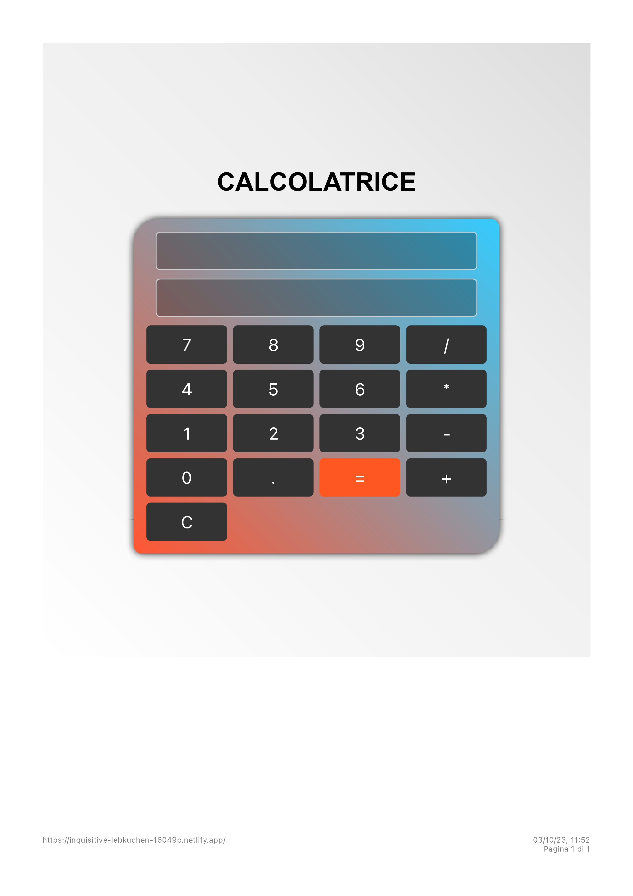

# Calcolatrice React

Benvenuto nella Calcolatrice React, un'applicazione web semplice ma potente per effettuare calcoli matematici!

**[Prova la Calcolatrice](https://inquisitive-lebkuchen-16049c.netlify.app/)**

## Caratteristiche

- Esegui operazioni matematiche di base come addizione, sottrazione, moltiplicazione e divisione.
- Usa il pulsante "=" per ottenere il risultato.
- Cancella l'input o l'intera operazione con il pulsante "C".
- Gestisci espressioni matematiche complesse.
